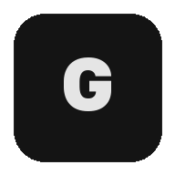

# Ghost Chat

Zero-trace P2P encrypted messenger with voice calls. Messages exist only in memory — nothing is stored on any server.

<p align="center">
  
</p>

## Features

- **End-to-end encryption** — ECDH P-256 + HKDF + AES-256-GCM
- **Perfect Forward Secrecy** — automatic key rotation every 50 messages
- **Peer-to-peer** — messages go directly between browsers via WebRTC DataChannel
- **Encrypted voice calls** — DTLS-SRTP over the same P2P connection
- **Zero storage** — no database, no logs, no message persistence
- **One-time invite links** — each room link works exactly once
- **Privacy mode** — relay-only ICE policy hides your real IP
- **Security monitoring** — detects screen capture, new audio devices, tab switching during calls
- **Self-destructing messages** — auto-delete after 5 minutes
- **Safety Numbers** — SHA-256 fingerprint verification between peers
- **PWA** — installable on mobile, works offline

## How it works

```
Host creates room → Server generates one-time ID
                   ↓
Guest joins via invite link → WebRTC handshake via signaling server
                            ↓
P2P DataChannel opens → Server is no longer needed
                      ↓
ECDH key exchange → AES-256-GCM encrypted messaging
```

The signaling server is stateless — it only relays WebRTC handshake data during connection setup. Once the P2P channel is established, all communication (messages, calls, control signals) flows directly between browsers.

## Quick Start

```bash
npm install
npm run dev
```

Open `http://localhost:3000`. No build step required — vanilla JS served as static files.

## Tech Stack

- **Server:** Node.js + [ws](https://github.com/websockets/ws) (single dependency)
- **Client:** Vanilla JavaScript, Web Crypto API, WebRTC
- **Encryption:** ECDH P-256, HKDF-SHA256, AES-256-GCM
- **Voice:** WebRTC audio tracks with DTLS-SRTP
- **Deploy:** Docker Compose (Node.js + Nginx + coturn + Certbot)

## Architecture

```
server/index.js              Signaling server + static file server
client/js/app.js             Main orchestrator (GhostChat class)
client/js/crypto.js          E2E encryption (GhostCrypto class)
client/js/webrtc.js          P2P connectivity (GhostRTC class)
client/js/voice.js           Encrypted voice calls (GhostVoice class)
client/js/security-monitor.js  Threat detection during calls
client/js/logger.js          Dev-only logging (suppressed in production)
deploy/                      Docker Compose stack for production
```

## Security Model

| Layer | Implementation |
|---|---|
| Key Exchange | ECDH P-256 over DataChannel |
| Key Derivation | HKDF-SHA256, bidirectional keys |
| Message Encryption | AES-256-GCM, unique IV per message |
| Forward Secrecy | Key rotation every 50 messages |
| Replay Protection | Timestamp + counter + nonce tracking |
| Traffic Analysis | 256-byte block padding |
| Voice Encryption | DTLS-SRTP (built into WebRTC) |
| IP Privacy | Optional relay-only ICE transport |
| TURN Auth | HMAC-SHA1 temporary credentials (1h TTL) |

## Deployment

See [deploy/DEPLOY.md](deploy/DEPLOY.md) for production deployment instructions with Docker Compose, Nginx, coturn TURN server, and Let's Encrypt SSL.

## Environment Variables

| Variable | Description | Default |
|---|---|---|
| `PORT` | Server port | `3000` |
| `NODE_ENV` | `production` suppresses logs, requires TURN_SECRET | — |
| `TRUST_PROXY` | Set `1` behind reverse proxy | — |
| `TURN_SECRET` | Shared secret for coturn HMAC-SHA1 auth | **required in prod** |
| `TURN_DOMAIN` | TURN server hostname | `localhost` |

## License

MIT
